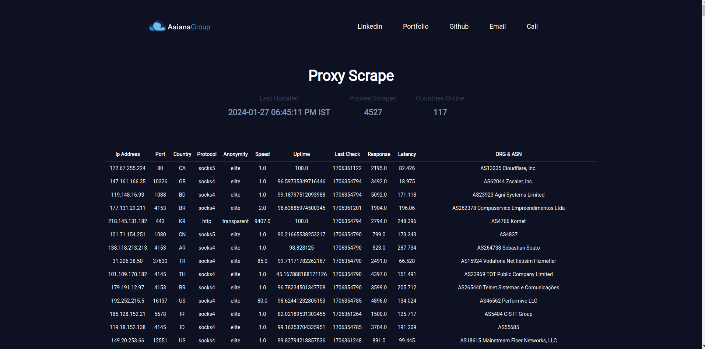

# Overview

Django Proxy Scraper is a Django project that utilizes Celery to perform daily scraping of proxy information from a public site, https://geonode.com/free-proxy-list. The scraped data includes IP addresses, ports, protocols, countries, and uptime of the proxies. The collected information is then stored in an SQLite database using the MVP (Model-View-Presenter) architecture.


# Features

1. Scraping Task: A Celery task has been implemented to scrape proxy information from the specified website.

2. Data Storage: The scraped data is saved into an SQLite database using the Django Model-View-Presenter (MVP) architecture.

3. Scheduled Execution: A Celery schedule has been set up to run the scraping task automatically every day, ensuring that the proxy information is regularly updated.

# Getting Started

## Prerequisites

1. Make sure you have Python and Django installed on your system.
2. Install Celery by running pip install celery.
3. Make sure you have redis installed on your computer and running on port 6378 (Not default 6379)

## Installation

1. Clone the repository.

```bash
git clone https://github.com/ananya26-vishnoi/Proxy_scrape.git
```
2. Create a Virtual Enviornment

```bash
python -m venv ve

# For windows:

./ve/bin/activate

# For Unix / Linux

source ve/bin/activate

cd Proxy_scrape
```

3. Installing Dependencies

```bash
pip install -r requirements.txt
```

4. Run the project

```bash
python3 manage.py runserver
```

5. Run Celery

```bash
redis-server --port 6378
```

6. Run the Celery

```bash
# In a new terminal
celery -A Proxy_scrape worker -l info
```

6. Run the Beat so scramming starts automatically at 8:00 AM

```bash
# In a new terminal
celery -A Proxy_scrape beat -l info
```

# Data View

You can simply see all scraped data afet opening ip: 127.0.0.1:8000


